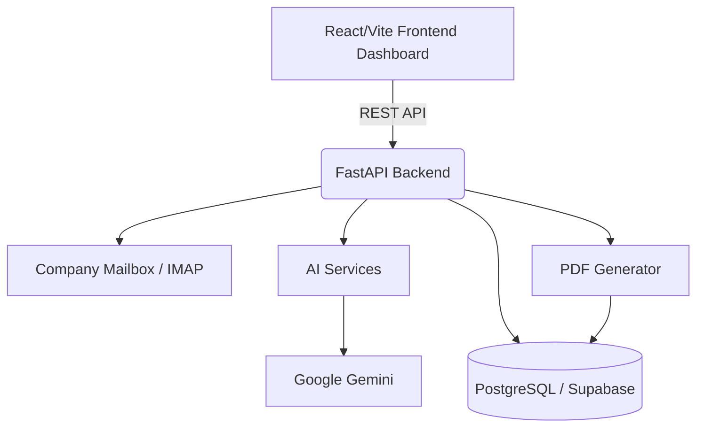
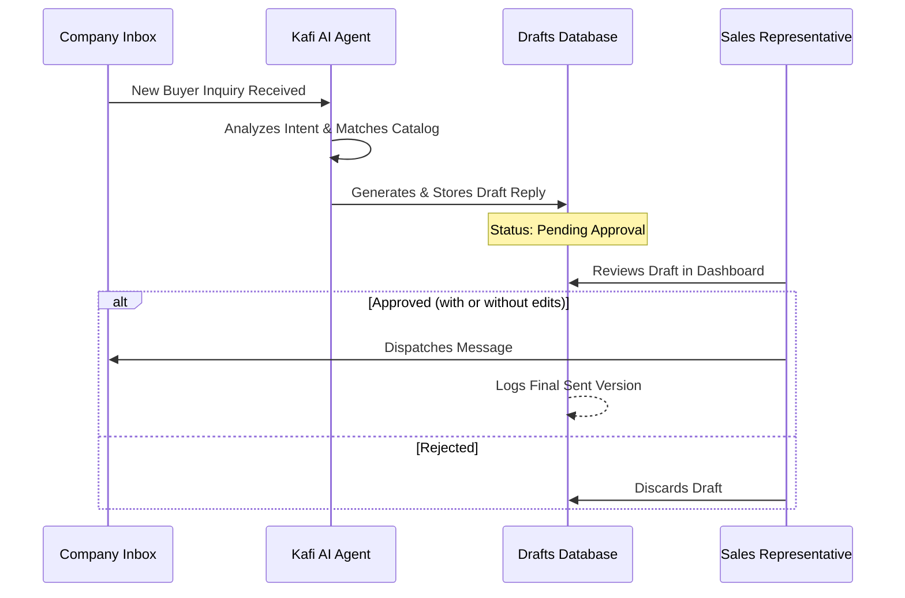

# Kafi Sales Agent — AI Sales Co-Pilot

An AI-powered B2B sales co-pilot built for Kafi Commodities (Pvt) Ltd. This platform helps the sales team discover, score, and convert international buyers for staples like spices, rice, and Essence pink salt. It centralizes lead intelligence, AI-drafted communications, and automated quoting while strictly enforcing human-in-the-loop control over all outbound messaging.

## 🔗 Live Links & Environments

* **Live Dashboard (Production):** [https://kafi-sales-agent.vercel.app](https://www.google.com/search?q=https://kafi-sales-agent.vercel.app)
* **Local Dashboard:** `http://localhost:5173` *(Requires `npm run dev`)*
* **API Docs (Swagger):** `[http://127.0.0.1:8001/docs](http://127.0.0.1:8001/docs)` *(Requires backend startup)*

---

## 🎯 What This Project Does

* **Automates Lead Intelligence:** Captures leads from manual entry, CSVs, or trade shows, automatically researching their public presence to score them against Kafi's 177-SKU catalog.
* **Accelerates Response Times:** A unified AI mailbox summarizes incoming company emails and generates instant, context-aware draft replies.
* **Streamlines Quotations:** Instantly generates professional PDF quotations, factoring in category pricing, FCL container capacity, and carton dimensions.
* **Ensures Complete Control:** Operates on a strict zero-auto-send policy. Every AI-generated communication remains a draft until explicitly approved by a sales representative.

---

## ✨ Core Features

### 1. Lead Scoring & Classification

* **Smart Parsing:** Ingests raw buyer data and extracts key business signals.
* **Catalog Matching:** Cross-references prospect needs with Kafi’s product categories.
* **Transparent Scoring:** Classifies leads as HOT, WARM, or COLD with detailed, AI-generated reasoning to guide sales prioritization.

### 2. Unified Mailbox with AI Assistant

* **Inbox Integration:** Full Inbox, Sent, Archive, and Trash management synced with the company mailbox.
* **Instant Context:** Opening an email automatically triggers an AI summary of the thread and the buyer's profile.
* **Draft Generation:** Drafts tailored replies, WhatsApp messages, or DMs in seconds, allowing reps to edit rather than write from scratch.

### 3. Smart Recommendations & Quoting

* **Upsell Suggestions:** Recommends cross-sell products based on the buyer's order history and profile.
* **FCL Optimization:** Built-in logic for Full Container Load (FCL) calculations to ensure accurate shipping estimates on PDF quotes.

### 4. Human-in-the-Loop Approvals

* **Dashboard Verification:** All AI-crafted outreach sits in a pending queue.
* **One-Click Send:** Reps review, tweak if necessary, and approve the message for dispatch directly from the dashboard.

### 5. Calls, Follow-ups, & Compliance

* **Relationship Tracking:** Quick-dial integrations, recent-call logging, and scheduled touchpoints for post-delivery check-ins.
* **Safe Scraping:** Respects `robots.txt` and utilizes official APIs only (no unauthorized LinkedIn scraping).
* **Audit Trails:** Maintains a full database log of all AI drafts, human edits, and final sent messages.

---

## 🏛️ Architecture



---

## 💻 Tech Stack

| Layer | Technologies |
| --- | --- |
| **Frontend** | React, Vite, Tailwind CSS |
| **Backend** | Python, FastAPI, Uvicorn |
| **Database & Auth** | PostgreSQL, Supabase |
| **AI Engine** | Google Gemini |
| **Infrastructure** | Vercel (Frontend), Railway (Backend) |

---

## 🗺️ Dashboard Guide

| Page | Route | Purpose |
| --- | --- | --- |
| **Dashboard** | `/` | High-level metrics, active hot leads, and pending tasks |
| **Inbox** | `/inbox` | Unified mail management with AI summaries and draft replies |
| **Leads** | `/leads` | CRM view of all captured companies, scoring, and research data |
| **Quotations** | `/quotes` | PDF generation tool for FCL-optimized pricing and carton dimensions |
| **Approvals** | `/approvals` | Human-in-the-loop queue for reviewing AI-generated outreach |
| **Settings** | `/settings` | Mailbox connection status, API keys, and user preferences |

---

## 🚦 Human-in-the-Loop Workflow



---

## 🚀 Quick Start (Local Development)

### 1. Backend Setup

```bash
cd backend
cp .env.example .env  # Fill in Supabase and Gemini keys
python -m venv venv
source venv/bin/activate  # or `venv\Scripts\activate` on Windows
pip install -r requirements.txt
uvicorn main:app --reload --port 8001
# API & Swagger Docs run on http://127.0.0.1:8001/docs

```

### 2. Frontend Setup

```bash
cd frontend
cp .env.example .env
npm install
npm run dev
# Frontend runs on http://localhost:5173

```

---

## ⚙️ Configuration (Key Env Vars)

**Backend (`.env`)**

* `DATABASE_URL`: PostgreSQL connection string (Supabase).
* `GEMINI_API_KEY`: Key for LLM lead analysis and draft generation.
* `MAIL_USERNAME` / `MAIL_PASSWORD` / `IMAP_SERVER`: Company mailbox credentials.
* `ENVIRONMENT`: `development` or `production`.

**Frontend (`.env`)**

* `VITE_API_URL`: Points to backend (e.g., Railway URL in production or `[http://127.0.0.1:8001](http://127.0.0.1:8001)`).

---

## 📂 Project Structure

```text
├── backend/
│   ├── app/                # FastAPI application code (routers, models, logic)
│   ├── prompts/            # System prompts for Lead Scoring & Email Drafting
│   ├── main.py             # FastAPI entry point
│   └── requirements.txt
├── frontend/
│   ├── src/
│   │   ├── components/     # Reusable React UI components
│   │   ├── pages/          # Dashboard routes (Inbox, Leads, Quotes)
│   │   └── utils/          # API clients and helpers
│   ├── package.json
│   └── vite.config.js
└── README.md

```

---

## ☁️ Deployment

* **Frontend:** Deployed automatically via **Vercel**.
* **Backend:** Hosted on **Railway**, managing the FastAPI service and integration hooks.
* **Database:** Managed via **Supabase** (PostgreSQL).

---

**License:** MIT
**Author:** Izaan Mujeeb (Built for Kafi Commodities Pvt Ltd)
