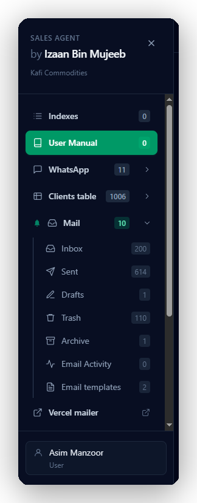
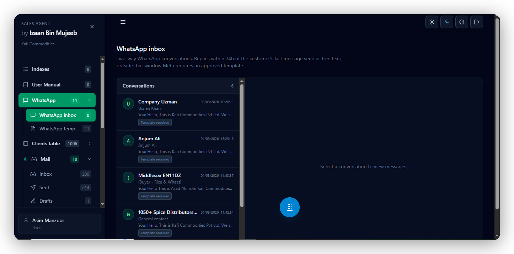
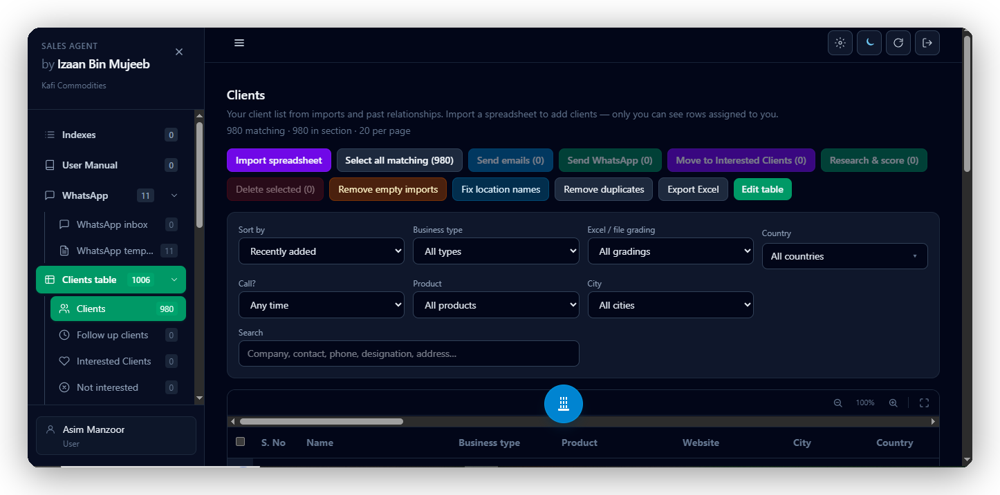
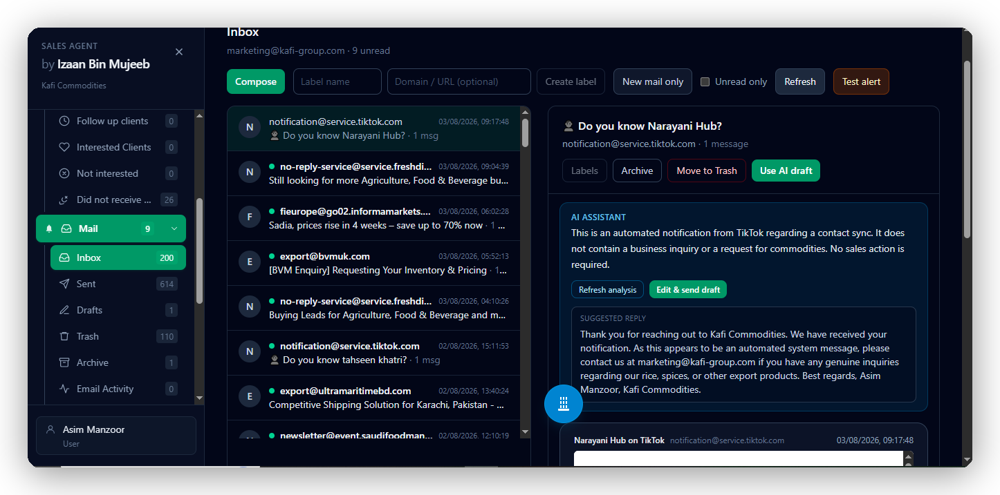
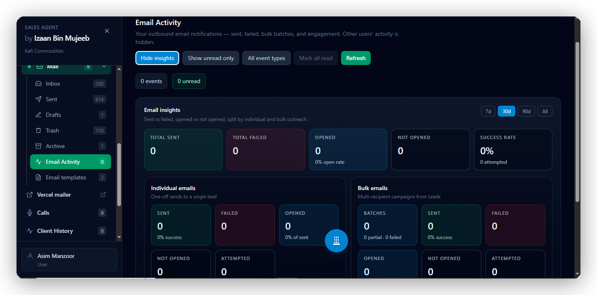
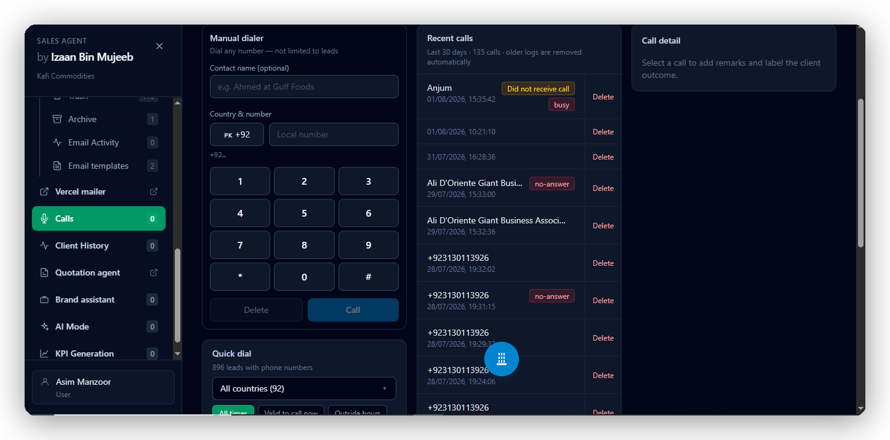
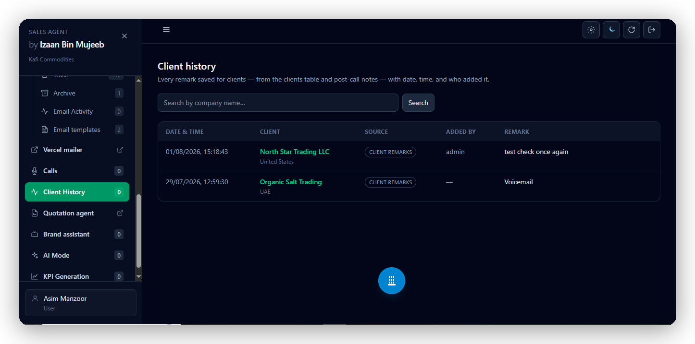
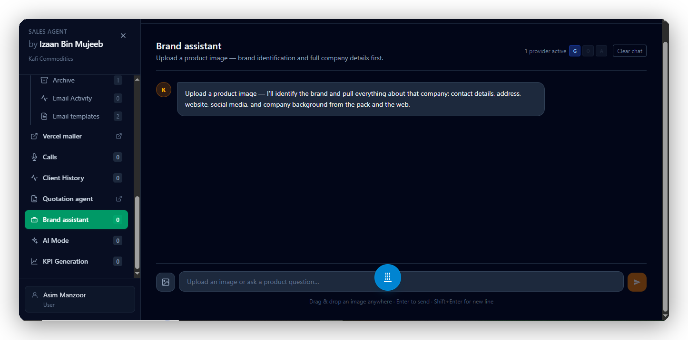
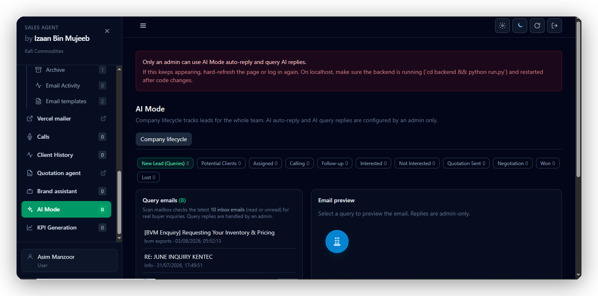
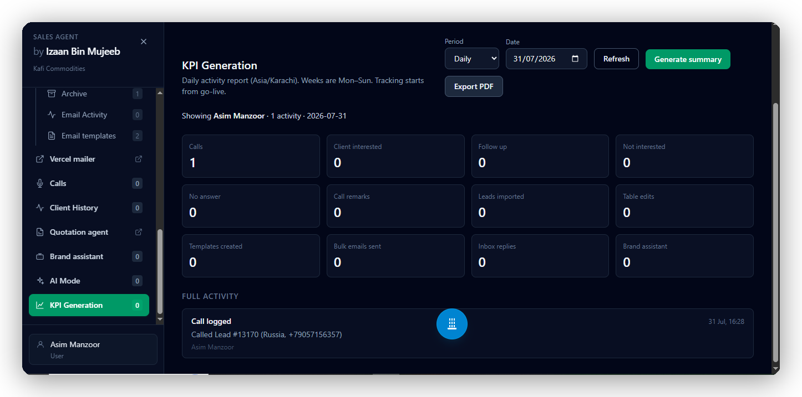

<div align="center">

# 🚀 Sellara AI
### The AI Sales Co-Pilot for Global B2B Trade

*Discover buyers, score leads, and close deals across email, WhatsApp, and voice — with AI drafting and humans deciding.*

[]()
[]()
[]()
[]()
[-3ecf8e)]()
[]()

[Live Demo](https://kafi-sales-agent.vercel.app) · [Report Bug](#) · [Request Feature](#)

</div>

---

## 🧭 What is Sellara AI?

Sellara AI is a **co-pilot, not an autopilot** for B2B sales teams. It was built and battle-tested for **Kafi Commodities (Pvt) Ltd**, a Pakistani food exporter since 1982, to help their sales team discover, score, call, email, and WhatsApp international buyers of rice, condiments, Himalayan pink salt, spices, sauces, pickles, honey, and related staples — but the architecture is product-agnostic and ready to power any export or B2B sales operation.

> **Core principle:** AI drafts outreach and suggests next steps. Humans approve, edit, and send. Bulk flows and AI Mode auto-reply are opt-in and fully admin-controlled.

<table>
<tr>
<td width="50%" valign="top">

### ✨ What it does
- 🔍 **Discover** — web-search-powered lead discovery + CSV import
- 🧠 **Research & score** — website analysis, product-fit matching, AAA/AA/A grading
- 📞 **Work leads** — browser calling, email, WhatsApp, bulk campaigns
- 📊 **Track outcomes** — automatic pipeline routing from call/email results
- 🔁 **Lifecycle pipeline** — New Lead → Won/Lost with full activity feeds
- 💬 **Unified inbox** — email + WhatsApp with optional AI auto-reply
- 🧾 **Quote** — connects to an external quotation agent for PDF quotes
- 📈 **Report** — daily KPI generation with AI-written summaries

</td>
<td width="50%" valign="top">

### 🛠️ Built with
- **Frontend:** React 18, Vite, TypeScript, Tailwind CSS
- **Backend:** Python 3, FastAPI, Uvicorn, APScheduler
- **Database:** PostgreSQL (Supabase, session pooler)
- **AI:** Google Gemini — lead analysis, chatbot, drafts, KPI summaries
- **Voice:** Twilio Programmable Voice (browser SDK)
- **Messaging:** Meta WhatsApp Cloud API
- **Discovery:** SerpAPI
- **Deploy:** Vercel (UI) · Railway (API) · Supabase (DB)

</td>
</tr>
</table>

---

## 📸 Product tour

<div align="center">

<p><i>Every module — WhatsApp, Mail, Calls, AI Mode, KPIs — lives in one sidebar.</i></p>
</div>

<table>
<tr>
<td width="50%">

**💬 WhatsApp Inbox**
Two-way conversations inside Meta's 24h window, with automatic template fallback for cold leads.



</td>
<td width="50%">

**📋 Clients Table**
Full pipeline view with grading, filters, and bulk actions across 900+ leads.



</td>
</tr>
<tr>
<td width="50%">

**🧠 AI-Drafted Replies**
Every inbound email gets an AI read + a suggested reply — the human decides whether to send it.



</td>
<td width="50%">

**📈 Email Activity Dashboard**
Sent vs. failed, open rates, and bulk campaign performance at a glance.



</td>
</tr>
<tr>
<td width="50%">

**📞 Browser Calling**
Dial straight from the browser with automatic call logging and outcome tracking.



</td>
<td width="50%">

**🗂️ Client History**
Every remark, from table notes to post-call outcomes, in one searchable timeline.



</td>
</tr>
<tr>
<td width="50%">

**🎨 Brand Assistant**
Drop in a product image and get instant brand ID plus full company background.



</td>
<td width="50%">

**🔁 AI Mode Lifecycle**
The full deal pipeline — New Lead through Won/Lost — tracked automatically as leads move.



</td>
</tr>
<tr>
<td width="50%">

**📊 KPI Generation**
Daily activity reports with AI-written summaries, exportable straight to PDF.



</td>
<td width="50%">

</td>
</tr>
</table>

---

## 🏗️ Architecture

```
                    React / Vite (Vercel)
                            │
                        /api → proxy
                            │
                    FastAPI (Railway)
        ┌───────────────────┼───────────────────┐
        │                   │                   │
    api/ (routes)     modules/ (logic)   integrations/
                                          Gmail · IMAP · Twilio
                                          WhatsApp · Gemini · SerpAPI
                            │
                    db/ (SQLAlchemy + Alembic)
                            │
              PostgreSQL (Supabase)
```

> **Rule of thumb:** `api/` never touches the DB directly, and `frontend/src/api/client.ts` is the *only* frontend API layer.

### Lead intelligence pipeline

```
Discover / Import / Manual entry
            │
            ▼
   Research (website + signals)
            │
            ▼
   Product fit (177 SKU catalog)
            │
            ▼
Score  HOT / WARM / COLD  +  AAA / AA / A grade
            │
            ▼
    Assign → Call / Email / WhatsApp
            │
            ▼
Interested → Quotation Sent → Negotiation → Won / Lost
```

---

## 👥 Roles & access

| Role | Access |
|------|--------|
| **Admin** | Full pipeline — Discover Leads, Master table, all assignee views, user management, AI Mode, all email activity |
| **Sales user** | Assigned leads only, own KPI, scoped lifecycle data, own email activity |

Auth uses session cookies with optional bearer-token backup. Per-user IMAP/SMTP mailboxes are configured under **Users**.

---

## 📦 Feature guide

<details>
<summary><b>💬 WhatsApp (Meta Cloud API)</b></summary>
<br>

**Inbox:** two-way conversations within Meta's 24-hour customer service window; approved templates required outside that window; inbound webhook opens the session.

**Templates:** sync from Meta, create & submit for review in-app, real-time approval/rejection alerts, API health check banner, admin test-send tool.

**From leads tables:** single-lead compose (personal message or template), `wa.me` deep link for cold outreach, bulk send with variables, marketing opt-in compliance toggle.

</details>

<details>
<summary><b>🔎 Discover Leads (admin only)</b></summary>
<br>

SerpAPI-backed search by company, country, and product keywords. Enrich before import. CSV upload for directories/trade shows. Async import jobs with progress polling. New rows land in **Scrapped Leads**.

</details>

<details>
<summary><b>📋 Master table / Clients table</b></summary>
<br>

**Admin buckets:** Scrapped Leads · Old clients · Follow up · Interested · Not interested · Did not receive call · Leads Sent To {user}

**Sales view:** only their assigned leads across the same buckets.

**Table tools:** search/filter/sort, inline edit, CSV import, bulk delete/assign/email/WhatsApp, row-level Call/Email/WhatsApp/Profile actions, admin dedupe & cleanup tools.

</details>

<details>
<summary><b>👤 Buyer profile</b></summary>
<br>

Company + contact details, website research, product-fit matching, HOT/WARM/COLD scoring with reasoning, editable AAA/AA/A grading, cross-sell suggestions, call history with recordings & transcription, full interaction timeline, client history notes, onboarding trigger.

</details>

<details>
<summary><b>📧 Mail</b></summary>
<br>

IMAP-synced folders (Inbox/Sent/Drafts/Trash/Archive), unread toasts, thread view, AI thread analysis, custom labels, inbox cutoff date, full email activity audit trail with open tracking, reusable templates with merge fields, bulk email with overlap protection and stagger delay.

</details>

<details>
<summary><b>📞 Calls (Twilio Voice)</b></summary>
<br>

Browser-based calling from the leads table or floating dialpad, mandatory post-call outcome selection (Interested / Follow up / Not interested / Did not receive call), full call log with recordings and optional transcription.

</details>

<details>
<summary><b>🤖 AI Mode</b></summary>
<br>

Admin-controlled auto-reply for email + WhatsApp (independent toggles), keyword-based query detection, Gemini-drafted replies with template fallback, full 10-stage lifecycle pipeline (New Lead → Won/Lost), meeting alerts, real-time app-wide toasts. Auto-reply only applies to messages received *after* AI Mode is enabled.

</details>

<details>
<summary><b>📊 KPI generation</b></summary>
<br>

Daily activity reports (Asia/Karachi day boundaries) covering calls, outcomes, edits, imports, emails, chatbot sessions. Per-user or team rollup for admins, AI-written summaries, PDF export.

</details>

<details>
<summary><b>🔐 Compliance</b></summary>
<br>

Consent tracking (unknown/granted/denied), WhatsApp marketing opt-in flags, no LinkedIn scraping (official API/CSV only), `robots.txt` respected on website fetch, full audit log for AI drafts, approvals, and sends.

</details>

---

## 🔌 API overview

| Prefix | Purpose |
|--------|---------|
| `/api/auth` | Login, logout, users, assignees |
| `/api/leads` | Buyers, contacts, discover, import, research, score |
| `/api/inbox` | Mail folders, threads, compose, reply, analyze |
| `/api/interactions` | Drafts, approve/reject, bulk email drafts |
| `/api/email-templates` | CRUD + preview |
| `/api/email-activity` | Send audit + insights |
| `/api/whatsapp` | Templates, inbox, bulk send, config |
| `/api/calls` | Twilio voice, history, recordings, transcribe |
| `/api/ai-mode` | Settings, lifecycle, queries, meeting alerts |
| `/api/chatbot` | Brand assistant |
| `/api/kpi` | Daily reports + AI summary |
| `/api/compliance` | Consent + opt-in management |
| `/api/jobs` | Scheduler triggers |
| `/api/track` | Email open pixel |
| `/webhooks/whatsapp` | Meta inbound messages + template status |
| `/webhooks/twilio` | Voice status + recordings |

📖 Interactive docs available at `http://127.0.0.1:8001/docs` when running locally.

---

## ⚙️ Configuration

<details>
<summary><b>Backend environment variables</b></summary>
<br>

| Variable | Purpose |
|----------|---------|
| `DATABASE_URL` | PostgreSQL (Supabase pooler URL) |
| `GEMINI_API_KEY` | LLM features |
| `SERPAPI_KEY` | Discover Leads + AI Mode research |
| `MAIL_*` | Per-user IMAP/SMTP inbox |
| `TWILIO_*` | Browser calling |
| `WHATSAPP_ACCESS_TOKEN` | Meta Cloud API (permanent system-user token) |
| `WHATSAPP_PHONE_NUMBER_ID` | Sending number ID |
| `WHATSAPP_BUSINESS_ACCOUNT_ID` | WABA — templates + sync |
| `WHATSAPP_APP_SECRET` | Webhook signature verification |
| `WHATSAPP_WEBHOOK_VERIFY_TOKEN` | Webhook handshake |
| `MAILER_PUBLIC_URL` | Mailer SSO handoff |
| `TWILIO_WEBHOOK_BASE_URL` | Public URL for Twilio callbacks |

**Required WhatsApp token scopes:** `whatsapp_business_messaging`, `whatsapp_business_management`
**Webhook fields to subscribe:** `messages`, `message_template_status_update`

⚠️ Never commit `.env` — keep only `.env.example` with placeholder values tracked in git.

</details>

<details>
<summary><b>Frontend environment variables</b></summary>
<br>

| Variable | Purpose |
|----------|---------|
| `VITE_BACKEND_URL` | Local: `http://127.0.0.1:8001` |
| `VITE_API_BASE_URL` | Production: `/api` (same-origin via Vercel rewrite) |
| `VITE_QUOTATION_AGENT_URL` | External quotation PDF app |

</details>

---

## 🚀 Getting started

### Backend

```bash
cd backend
cp .env.example .env      # fill in Supabase, Gemini, mail, Twilio, WhatsApp
python -m venv venv
source venv/bin/activate  # Windows: venv\Scripts\activate
pip install -r requirements.txt
python run.py             # auto-migrates DB, starts on :8001
```

### Frontend

```bash
cd frontend
cp .env.example .env
npm install
npm run dev                # http://localhost:5173
```

> Optional root launcher: `python run.py` from the repo root.

---

## ☁️ Deployment

| Component | Host | Notes |
|-----------|------|-------|
| Frontend | **Vercel** | Rewrites `/api` → Railway backend |
| Backend | **Railway** | FastAPI + webhooks |
| Database | **Supabase** | Migrations run on backend startup |

After deploying: set Railway env vars (same as `.env`), point the Meta webhook URL to your Railway public API, and refresh the WhatsApp token before it expires.

---

## 📁 Project structure

```
sellara-ai/
├── backend/
│   ├── api/              # FastAPI routers
│   ├── modules/          # Business logic (leads, research, ai_mode, comms, calls)
│   ├── integrations/     # WhatsApp, Twilio, mail clients
│   ├── db/                # Models + Alembic migrations
│   ├── data/              # Product catalog, pricing, dimensions
│   ├── prompts/           # LLM prompt templates
│   ├── scripts/           # Import utilities
│   └── run.py              # Startup + migrate
├── frontend/
│   └── src/
│       ├── api/client.ts  # Single API layer
│       ├── pages/          # Dashboard screens
│       └── components/    # Shared UI
├── mailer/                 # Separate mailer app
└── README.md
```

---

## 🔁 Human-in-the-loop workflow

```
Inbound inquiry (email / WhatsApp / call)
            │
            ▼
AI analyzes → drafts reply → suggests products → updates lifecycle
            │
            ▼
     Human reviews in dashboard
            │
            ▼
   Approve & send (or auto-send for configured bulk/template flows)
            │
            ▼
   Audit log + email activity + lifecycle update
```

AI Mode auto-reply is **off by default**. When enabled, it only responds to messages received after the enable timestamp, and always respects compliance rules.

---

## 🧰 Troubleshooting

| Issue | Fix |
|-------|-----|
| WhatsApp template submit does nothing | Refresh `WHATSAPP_ACCESS_TOKEN` (expired tokens return 401); restart backend |
| Personal WA message switches to template | Cold lead — Meta requires an approved template; use the template tab or "Open in WhatsApp" |
| Sales user sees admin's lifecycle counts | Fixed in latest — lifecycle is scoped to assigned leads; pull latest code |
| Inbox not syncing | Check mailbox credentials under **Users** |
| Browser calling not ready | Set Twilio env vars + a public webhook URL (ngrok for local dev) |

---

<div align="center">

**License:** MIT · **Built by:** Izaan Mujeeb
*Flagship deployment: Kafi Commodities (Pvt) Ltd — food exporter since 1982*

</div>
